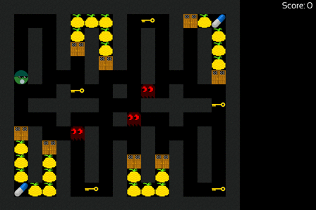

# **Pac-Man Clone**  
_Super Pac-Man_ is an arcade game created in 1982 as a spin-off of the popular game _Pac-Man_. In the western world Pac-Man's [reception](https://en.wikipedia.org/wiki/Pac-Man#Reception) was a resounding success and is an iconic landmark in gaming history.  

    
   

## **About**
This is an (unpolished and old) project with the desire being an emphasis on good object-oriented design, modern ANSI/ISO C++ and comprehensive unit testing. The majority of the final code was written in a day or two and there are still several issues with the design and implementation - the __monolithic__ `handler` classes for example. Still it is a nice little project.  

The game runs on the Windows and has been confirmed to work with [WINE](https://www.winehq.org/) on Linux.  

## **Play**
Start Pacman.exe

## **Features**  
Most people should be familiar with the Pac-Man game loop. You control a sprite moving through a maze, eating fruit and running away from ghosts. 

###  **Basic Functionality**   

- The maze contains:  
  - Fruit in (initially) locked sections  
  - Pac-Man, the player avatar  
  - A couple of ghosts  
  - Keys which open doors to the locked sections.  

- Pac-Man is controlled by the player and can move around the maze but not through the maze walls or locked maze sections.  

- The ghosts move on their own throughout the maze, including any opened sections, and they chase Pac-Man (in a basic manner). They cannot move through the maze walls or into unopened sections. If any of them touches Pac-Man, he dies, and the game is over.  

- Whenever Pac-Man moves over a key it disappears and one, or more, doors to the locked sections of the maze can be opened allowing Pac-Man to enter and eat the fruit. If Pac-Man eats all the fruit contained in the locked sections the game end with you as the winner.  

### **Minor Feature Enhancements**  
- The maze contains at least two power pellets. When Pac-Man eats one of these the ghosts change colour and can be eaten by Pac-Man. This state lasts for a short period of time. If a ghost is eaten it re-spawns in the centre of the maze.

- The score is displayed and updated.    

- The structure of the maze is read in from a file.  

## **Requirements:**
- [MinGW Compiler](https://www.mingw-w64.org/) 
- [SFML 2.5.1](https://www.sfml-dev.org/index.php)
- [DOCtest](https://github.com/onqtam/doctest)

## **Authors**
- [James Allsop](https://github.com/JAllsop)
- [Musa Iqbal](https://github.com/kinz970724)

## **Source**
https://github.com/JAllsop/Pacman-Project
